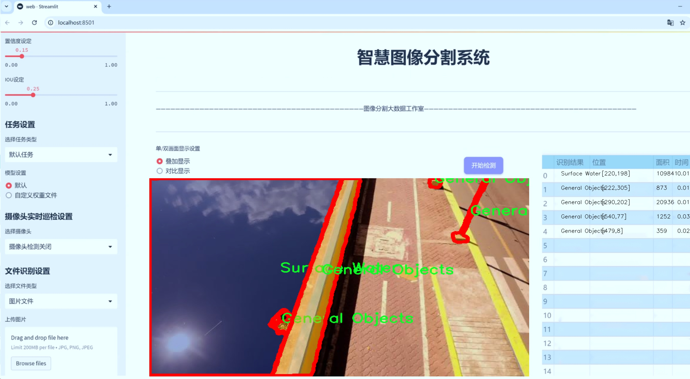
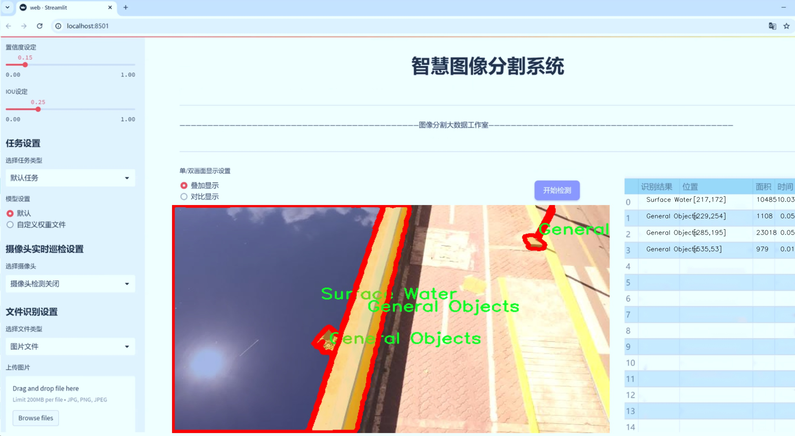
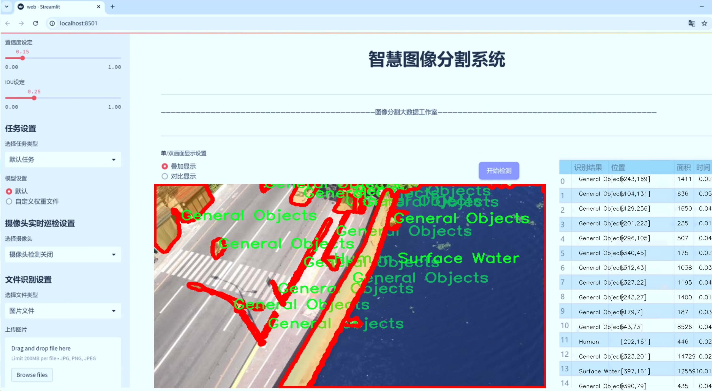
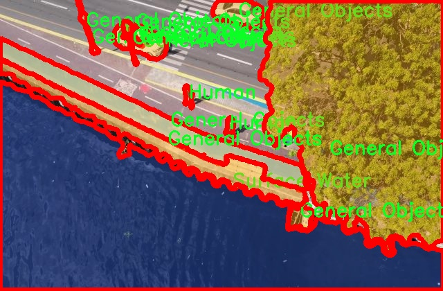
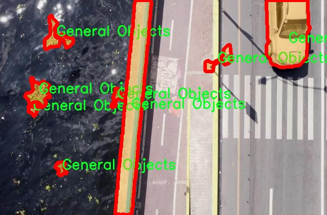
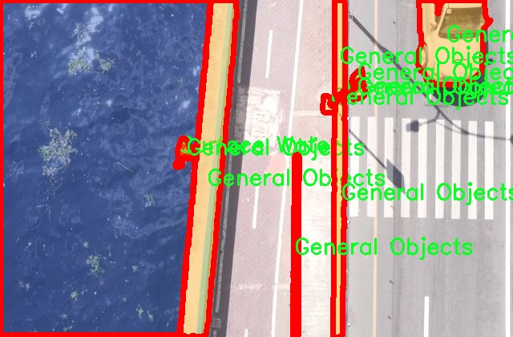
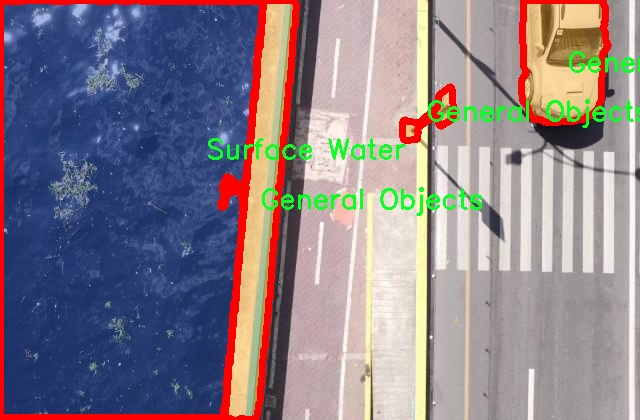
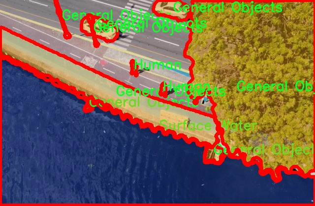

# 公路与水体场景图像分割系统： yolov8-seg-RCSOSA

### 1.研究背景与意义

[参考博客](https://gitee.com/YOLOv8_YOLOv11_Segmentation_Studio/projects)

[博客来源](https://kdocs.cn/l/cszuIiCKVNis)

研究背景与意义

随着城市化进程的加快和交通运输需求的不断增加，公路与水体场景的监测与管理变得愈发重要。公路不仅是交通运输的主要通道，也是城市发展和经济活动的关键基础设施。而水体作为自然资源和生态系统的重要组成部分，其健康状况直接影响到环境保护和可持续发展。因此，针对公路与水体场景的图像分割研究，不仅有助于提升交通管理的智能化水平，还能为水资源的保护与管理提供有效的技术支持。

近年来，深度学习技术的迅猛发展为图像分割任务提供了强大的工具。YOLO（You Only Look Once）系列模型因其高效的实时检测能力而受到广泛关注。YOLOv8作为该系列的最新版本，结合了多种先进的网络结构和优化算法，具备了更高的准确性和速度。然而，现有的YOLOv8模型在特定场景下的应用仍存在一定的局限性，尤其是在复杂的公路与水体场景中，目标物体的遮挡、光照变化以及背景干扰等因素都会影响分割效果。因此，基于改进YOLOv8的公路与水体场景图像分割系统的研究显得尤为必要。

本研究将利用一个包含1700幅图像的数据集，涵盖了三类目标：一般物体、人类和水面。这一数据集的多样性为模型的训练和验证提供了丰富的样本，能够有效提升模型的泛化能力。通过对数据集的深入分析，我们可以识别出公路与水体场景中的关键特征，进而设计出针对性的改进策略，以提升YOLOv8在图像分割任务中的表现。

在研究意义方面，首先，基于改进YOLOv8的图像分割系统将为公路交通管理提供实时、精准的监测手段。通过对公路场景中车辆、行人等目标的准确分割，相关部门可以更好地进行交通流量分析、事故预警和安全管理。其次，水体场景的监测对于环境保护至关重要。通过精确识别水面及其周边的生态环境变化，能够为水资源的管理和保护提供科学依据，促进可持续发展。此外，该研究还将推动图像分割技术在其他领域的应用，如城市规划、灾害监测等，具有广泛的社会和经济价值。

综上所述，基于改进YOLOv8的公路与水体场景图像分割系统的研究，不仅填补了现有技术在特定场景应用中的空白，也为相关领域的智能化发展提供了新的思路和方法。通过不断优化和完善模型，我们期望能够在实际应用中取得显著成效，为社会的可持续发展贡献力量。

### 2.图片演示







注意：本项目提供完整的训练源码数据集和训练教程,由于此博客编辑较早,暂不提供权重文件（best.pt）,需要按照6.训练教程进行训练后实现上图效果。

### 3.视频演示

[3.1 视频演示](https://www.bilibili.com/video/BV1GzUNYaE8p/)

### 4.数据集信息

##### 4.1 数据集类别数＆类别名

nc: 3
names: ['General Objects', 'Human', 'Surface Water']


##### 4.2 数据集信息简介

数据集信息展示

在本研究中，我们使用了名为“Merged”的数据集，以训练和改进YOLOv8-seg模型，专注于公路与水体场景的图像分割任务。该数据集包含三类主要对象，分别是“General Objects”（一般物体）、“Human”（人类）和“Surface Water”（水面），为模型提供了丰富的训练样本，以便在复杂的环境中实现高效的分割性能。

“Merged”数据集的设计考虑到了公路与水体场景的多样性和复杂性，涵盖了不同的天气条件、时间段以及多种地理环境。这种多样性确保了模型在实际应用中的鲁棒性和适应性，使其能够处理不同情况下的图像分割任务。数据集中包含的“General Objects”类别，涵盖了车辆、建筑物、交通标志等多种与公路场景相关的物体，这些对象的存在对于理解和分析公路环境至关重要。通过对这些一般物体的准确分割，模型能够更好地识别和处理交通流量、行人活动等动态因素。

在“Human”类别中，数据集包含了行人、骑自行车的人、跑步者等多种人类活动的图像。这一类别的引入不仅有助于提升模型对人类行为的识别能力，也为公路安全监测提供了重要的支持。通过对人类活动的准确分割，模型能够在交通管理、事故预防等领域发挥更大的作用。

“Surface Water”类别则专注于水体的识别与分割，包括河流、湖泊、池塘等多种水体类型。这一类别的存在使得模型能够在处理公路与水体交界的复杂场景时，准确区分水面与其他物体，从而提高整体的分割精度。在实际应用中，准确识别水体不仅对环境监测、生态保护具有重要意义，也为水上交通安全、洪水预警等提供了技术支持。

为了确保数据集的有效性和代表性，“Merged”数据集经过精心标注和筛选，确保每一类对象在不同场景中的样本均衡分布。这种均衡性使得模型在训练过程中能够充分学习到各类对象的特征，进而提升其在实际应用中的表现。此外，数据集还包含了丰富的图像背景信息，使得模型在处理复杂场景时能够更好地理解上下文，从而提高分割的准确性。

总之，“Merged”数据集为改进YOLOv8-seg的公路与水体场景图像分割系统提供了坚实的基础。通过对三类对象的深入分析与准确分割，模型将能够在实际应用中展现出更高的性能和可靠性，为交通管理、环境监测等领域带来显著的价值。未来的研究将继续探索如何进一步优化数据集的构建与模型的训练，以应对更为复杂的场景和任务需求。











### 5.项目依赖环境部署教程（零基础手把手教学）

[5.1 环境部署教程链接（零基础手把手教学）](https://www.bilibili.com/video/BV1jG4Ve4E9t/?vd_source=bc9aec86d164b67a7004b996143742dc)


[5.2 安装Python虚拟环境创建和依赖库安装视频教程链接（零基础手把手教学）](https://www.bilibili.com/video/BV1nA4VeYEze/?vd_source=bc9aec86d164b67a7004b996143742dc)

### 6.手把手YOLOV8-seg训练视频教程（零基础手把手教学）

[6.1 手把手YOLOV8-seg训练视频教程（零基础小白有手就能学会）](https://www.bilibili.com/video/BV1cA4VeYETe/?vd_source=bc9aec86d164b67a7004b996143742dc)


按照上面的训练视频教程链接加载项目提供的数据集，运行train.py即可开始训练



     Epoch   gpu_mem       box       obj       cls    labels  img_size
     1/200     0G   0.01576   0.01955  0.007536        22      1280: 100%|██████████| 849/849 [14:42<00:00,  1.04s/it]
               Class     Images     Labels          P          R     mAP@.5 mAP@.5:.95: 100%|██████████| 213/213 [01:14<00:00,  2.87it/s]
                 all       3395      17314      0.994      0.957      0.0957      0.0843

     Epoch   gpu_mem       box       obj       cls    labels  img_size
     2/200     0G   0.01578   0.01923  0.007006        22      1280: 100%|██████████| 849/849 [14:44<00:00,  1.04s/it]
               Class     Images     Labels          P          R     mAP@.5 mAP@.5:.95: 100%|██████████| 213/213 [01:12<00:00,  2.95it/s]
                 all       3395      17314      0.996      0.956      0.0957      0.0845

     Epoch   gpu_mem       box       obj       cls    labels  img_size
     3/200     0G   0.01561    0.0191  0.006895        27      1280: 100%|██████████| 849/849 [10:56<00:00,  1.29it/s]
               Class     Images     Labels          P          R     mAP@.5 mAP@.5:.95: 100%|███████   | 187/213 [00:52<00:00,  4.04it/s]
                 all       3395      17314      0.996      0.957      0.0957      0.0845


### 7.50+种全套YOLOV8-seg创新点加载调参实验视频教程（一键加载写好的改进模型的配置文件）

[7.1 50+种全套YOLOV8-seg创新点加载调参实验视频教程（一键加载写好的改进模型的配置文件）](https://www.bilibili.com/video/BV1Hw4VePEXv/?vd_source=bc9aec86d164b67a7004b996143742dc)

### YOLOV8-seg算法简介

原始YOLOv8-seg算法原理

YOLOv8-seg算法是YOLO系列中最新的目标检测与分割模型，旨在同时实现高效的目标检测和精确的图像分割。该算法的设计理念是通过深度学习技术，结合先进的网络结构，提升在复杂场景下的目标识别能力和分割精度。YOLOv8-seg的架构由输入层、主干网络、颈部网络和头部网络等多个部分组成，每个部分都经过精心设计，以确保模型在速度和精度上的最佳平衡。

在YOLOv8-seg的输入层，首先对输入图像进行预处理，包括缩放、数据增强和自适应锚框计算等。这些步骤不仅提高了模型的鲁棒性，还增强了其对不同尺寸和形状目标的适应能力。马赛克数据增强技术的引入，使得模型在训练过程中能够接触到更为丰富的样本变换，从而提升了其泛化能力。

主干网络是YOLOv8-seg的核心部分，采用了改进的C2f模块和SPPF结构。C2f模块通过多分支的跨层连接，增强了特征的梯度流动，使得网络在特征提取过程中能够更好地捕捉到目标的细节信息。与传统的卷积层相比，C2f模块的设计使得网络在处理复杂场景时，能够更有效地提取和融合多层次的特征信息。此外，SPPF模块通过多尺度的最大池化操作，进一步提升了网络的特征抽象能力，使得模型在面对不同尺度的目标时，依然能够保持较高的检测精度。

颈部网络则是YOLOv8-seg的重要组成部分，主要负责不同尺度特征图的信息融合。该部分采用了路径聚合网络（PAN）和特征金字塔网络（FPN）的结合，通过双向的信息流动，有效地增强了对不同尺寸目标的特征融合能力。这种结构的设计，使得YOLOv8-seg能够在处理复杂场景时，保持对小目标的敏感性，同时又不丧失对大目标的检测能力。

在头部网络中，YOLOv8-seg采用了解耦的检测头结构，将目标分类和边界框回归的过程分开进行。这种设计不仅提高了模型的训练效率，还使得损失计算过程更加灵活。具体而言，分类分支使用了二元交叉熵损失（BCELoss），而回归分支则结合了分布焦点损失（DFLoss）和完全交并比损失（CIOULoss），以提升模型对边界框预测的精准性。这种损失函数的选择，能够有效地引导模型在训练过程中更好地学习到目标的特征，提高了检测和分割的精度。

YOLOv8-seg在实现目标检测的同时，也特别关注图像分割的能力。通过在网络中引入分割头，YOLOv8-seg能够对每个检测到的目标进行像素级的分割。这一过程不仅依赖于主干网络提取的特征，还需要颈部网络对不同尺度特征的有效融合。分割头的设计使得模型能够在目标检测的基础上，进一步细化到每个目标的轮廓，提供更为精确的分割结果。

值得一提的是，YOLOv8-seg在模型轻量化方面也做出了显著的改进。通过优化网络结构，减少不必要的参数量，YOLOv8-seg能够在保持高精度的同时，实现更快的推理速度。这一特性使得YOLOv8-seg非常适合在实时应用场景中使用，如自动驾驶、安防监控和工业检测等领域。

总的来说，YOLOv8-seg算法通过其创新的网络结构和高效的特征提取机制，实现了目标检测与分割的双重任务。其在精度和速度上的优势，使得该算法在实际应用中展现出广泛的前景。随着深度学习技术的不断发展，YOLOv8-seg无疑将成为目标检测与分割领域的重要工具，为各类智能应用提供强有力的支持。


### 9.系统功能展示（检测对象为举例，实际内容以本项目数据集为准）

图9.1.系统支持检测结果表格显示

  图9.2.系统支持置信度和IOU阈值手动调节

  图9.3.系统支持自定义加载权重文件best.pt(需要你通过步骤5中训练获得)

  图9.4.系统支持摄像头实时识别

  图9.5.系统支持图片识别

  图9.6.系统支持视频识别

  图9.7.系统支持识别结果文件自动保存

  图9.8.系统支持Excel导出检测结果数据


### 10.50+种全套YOLOV8-seg创新点原理讲解（非科班也可以轻松写刊发刊，V11版本正在科研待更新）

#### 10.1 由于篇幅限制，每个创新点的具体原理讲解就不一一展开，具体见下列网址中的创新点对应子项目的技术原理博客网址【Blog】：


[10.1 50+种全套YOLOV8-seg创新点原理讲解链接](https://gitee.com/qunmasj/good)

#### 10.2 部分改进模块原理讲解(完整的改进原理见上图和技术博客链接)【如果此小节的图加载失败可以通过CSDN或者Github搜索该博客的标题访问原始博客，原始博客图片显示正常】
### YOLOv8简介

YOLOv8是一种最新的SOTA算法，提供了N/S/M/L/X尺度的不同大小模型，以满足不同场景的需求。本章对算法网络的新特性进行简要介绍。


1）骨干网络和Neck
开发者设计了C2f模块对CSPDarkNet 53和PAFPN进行改造。相比C3模块，C2f模块拥有更多的分支跨层链接，使模型的梯度流更加丰富，显著增强了模型的特征提取能力。
2)Head部分
Head部分采用无锚框设计，将分类任务和回归任务进行了解耦，独立的分支将更加专注于其所负责的特征信息。
3）损失计算
模型使用CIOU Loss作为误差损失函数，并通过最小化DFL进一步提升边界框的回归精度。同时模型采用了TaskAlignedAssigner样本分配策略，以分类得分和IOU的高阶组合作为指标指导正负样本选择，实现了高分类得分和高IOU的对齐，有效地提升了模型的检测精度。


### D-LKA Attention简介
自2010年代中期以来，卷积神经网络（CNNs）已成为许多计算机视觉应用的首选技术。它们能够从原始数据中自动提取复杂的特征表示，无需手动进行特征工程，这引起了医学图像分析社区的极大兴趣。许多成功的CNN架构，如U-Net、全卷积网络、DeepLab或SegCaps（分割胶囊），已经被开发出来。这些架构在语义分割任务中取得了巨大成功，先前的最新方法已经被超越。

在计算机视觉研究中，不同尺度下的目标识别是一个关键问题。在CNN中，可检测目标的大小与相应网络层的感受野尺寸密切相关。如果一个目标扩展到超出这个感受野的边界，这可能会导致欠分割结果。相反，与目标实际大小相比使用过大的感受野可能会限制识别，因为背景信息可能会对预测产生不必要的影响。

解决这个问题的一个有希望的方法涉及在并行使用具有不同尺寸的多个Kernel，类似于Inception块的机制。然而，由于参数和计算要求的指数增长，将Kernel大小增加以容纳更大的目标在实践中受到限制。因此，出现了各种策略，包括金字塔池化技术和不同尺度的扩张卷积，以捕获多尺度的上下文信息。

另一个直观的概念涉及将多尺度图像金字塔或它们的相关特征表示直接纳入网络架构。然而，这种方法存在挑战，特别是在管理训练和推理时间方面的可行性方面存在挑战。在这个背景下，使用编码器-解码器网络，如U-Net，已被证明是有利的。这样的网络在较浅的层中编码外观和位置，而在更深的层中，通过神经元的更广泛的感受野捕获更高的语义信息和上下文信息。

一些方法将来自不同层的特征组合在一起，或者预测来自不同尺寸的层的特征以使用多尺度的信息。此外，出现了从不同尺度的层中预测特征的方法，有效地实现了跨多个尺度的见解整合。然而，大多数编码器-解码器结构面临一个挑战：它们经常无法在不同尺度之间保持一致的特征，并主要使用最后一个解码器层生成分割结果。

语义分割是一项任务，涉及根据预定义的标签集为图像中的每个像素预测语义类别。这项任务要求提取高级特征同时保留初始的空间分辨率。CNNs非常适合捕获局部细节和低级信息，尽管以忽略全局上下文为代价。视觉Transformer（ViT）架构已经成为解决处理全局信息的视觉任务的关键，包括语义分割，取得了显著的成功。

ViT的基础是注意力机制，它有助于在整个输入序列上聚合信息。这种能力使网络能够合并远程的上下文提示，超越了CNN的有限感受野尺寸。然而，这种策略通常会限制ViT有效建模局部信息的能力。这种局限可能会妨碍它们检测局部纹理的能力，这对于各种诊断和预测任务至关重要。这种缺乏局部表示可以归因于ViT模型处理图像的特定方式。

ViT模型将图像分成一系列Patch，并使用自注意力机制来模拟它们之间的依赖关系。这种方法可能不如CNN模型中的卷积操作对感受野内提取局部特征有效。ViT和CNN模型之间的这种图像处理方法的差异可能解释了CNN模型在局部特征提取方面表现出色的原因。

近年来，已经开发出创新性方法来解决Transformer模型内部局部纹理不足的问题。其中一种方法是通过互补方法将CNN和ViT特征结合起来，以结合它们的优势并减轻局部表示的不足。TransUNet是这种方法的早期示例，它在CNN的瓶颈中集成了Transformer层，以模拟局部和全局依赖关系。HiFormer提出了一种解决方案，将Swin Transformer模块和基于CNN的编码器结合起来，生成两个多尺度特征表示，通过Double-Level Fusion模块集成。UNETR使用基于Transformer的编码器和CNN解码器进行3D医学图像分割。CoTr和TransBTS通过Transformer在低分辨率阶段增强分割性能，将CNN编码器和解码器连接在一起。

增强局部特征表示的另一种策略是重新设计纯Transformer模型内部的自注意力机制。在这方面，Swin-Unet在U形结构中集成了一个具有线性计算复杂性的Swin Transformer块作为多尺度 Backbone 。MISSFormer采用高效Transformer来解决视觉Transformer中的参数问题，通过在输入块上进行不可逆的降采样操作。D-Former引入了一个纯Transformer的管道，具有双重注意模块，以分段的方式捕获细粒度的局部注意和与多元单元的交互。然而，仍然存在一些特定的限制，包括计算效率低下，如TransUNet模型所示，对CNN Backbone 的严重依赖，如HiFormer所观察到的，以及对多尺度信息的忽略。

此外，目前的分割架构通常采用逐层处理3D输入 volumetric 的方法，无意中忽视了相邻切片之间的潜在相关性。这一疏忽限制了对 volumetric 信息的全面利用，因此损害了定位精度和上下文集成。此外，必须认识到，医学领域的病变通常在形状上发生变形。因此，用于医学图像分析的任何学习算法都必须具备捕捉和理解这些变形的能力。与此同时，该算法应保持计算效率，以便处理3D volumetric数据。

为了解决上述提到的挑战，作者提出了一个解决方案，即可变形大卷积核注意力模块（Deformable LKA module），它是作者网络设计的基本构建模块。这个模块明确设计成在有效处理上下文信息的同时保留局部描述符。作者的架构在这两个方面的平衡增强了实现精确语义分割的能力。

值得注意的是，参考该博客引入了一种基于数据的感受野的动态适应，不同于传统卷积操作中的固定滤波器Mask。这种自适应方法使作者能够克服与静态方法相关的固有限制。这种创新方法还扩展到了D-LKA Net架构的2D和3D版本的开发。

在3D模型的情况下，D-LKA机制被量身定制以适应3D环境，从而实现在不同 volumetric 切片之间无缝信息交互。最后，作者的贡献通过其计算效率得到进一步强调。作者通过仅依靠D-LKA概念的设计来实现这一点，在各种分割基准上取得了显著的性能，确立了作者的方法作为一种新的SOTA方法。

在本节中，作者首先概述方法论。首先，作者回顾了由Guo等人引入的大卷积核注意力（Large Kernel Attention，LKA）的概念。然后，作者介绍了作者对可变形LKA模块的创新探索。在此基础上，作者介绍了用于分割任务的2D和3D网络架构。

大卷积核提供了与自注意力机制类似的感受野。可以通过使用深度卷积、深度可扩展卷积和卷积来构建大卷积核，从而减少了参数和计算量。构建输入维度为和通道数的卷积核的深度卷积和深度可扩展卷积的卷积核大小的方程如下：


具有卷积核大小和膨胀率。参数数量和浮点运算（FLOPs）的计算如下：


FLOPs的数量与输入图像的大小成线性增长。参数的数量随通道数和卷积核大小的增加而呈二次增长。然而，由于它们通常都很小，因此它们不是限制因素。

为了最小化对于固定卷积核大小K的参数数量，可以将方程3对于膨胀率的导数设定为零：


例如，当卷积核大小为时，结果是。将这些公式扩展到3D情况是直接的。对于大小为和通道数C的输入，3D情况下参数数量和FLOPs 的方程如下：


具有卷积核大小和膨胀。


利用大卷积核进行医学图像分割的概念通过引入可变形卷积得以扩展。可变形卷积可以通过整数偏移自由调整采样网格以进行自由变形。额外的卷积层从特征图中学习出变形，从而创建一个偏移场。基于特征本身学习变形会导致自适应卷积核。这种灵活的卷积核形状可以提高病变或器官变形的表示，从而增强了目标边界的定义。

负责计算偏移的卷积层遵循其相应卷积层的卷积核大小和膨胀。双线性插值用于计算不在图像网格上的偏移的像素值。如图2所示，D-LKA模块可以表示为：


其中输入特征由表示，。表示为注意力图，其中每个值表示相应特征的相对重要性。运算符  表示逐元素乘法运算。值得注意的是，LKA不同于传统的注意力方法，它不需要额外的规范化函数，如或。这些规范化函数往往忽视高频信息，从而降低了基于自注意力的方法的性能。

在该方法的2D版本中，卷积层被可变形卷积所替代，因为可变形卷积能够改善对具有不规则形状和大小的目标的捕捉能力。这些目标在医学图像数据中常常出现，因此这种增强尤为重要。

然而，将可变形LKA的概念扩展到3D领域会带来一定的挑战。主要的约束来自于需要用于生成偏移的额外卷积层。与2D情况不同，由于输入和输出通道的性质，这一层无法以深度可分的方式执行。在3D环境中，输入通道对应于特征，而输出通道扩展到，其中是卷积核的大小。大卷积核的复杂性导致沿第3D的通道数扩展，导致参数和FLOPs大幅增加。因此，针对3D情况采用了另一种替代方法。在现有的LKA框架中，深度卷积之后引入了一个单独的可变形卷积层。这种战略性的设计调整旨在减轻扩展到3D领域所带来的挑战。


2D网络的架构如图1所示。第一变种使用MaxViT作为编码器组件，用于高效特征提取，而第二变种则结合可变形LKA层进行更精细、卓越的分割。

在更正式的描述中，编码器生成4个分层输出表示。首先，卷积干扰将输入图像的维度减小到。随后，通过4个MaxViT块的4个阶段进行特征提取，每个阶段后跟随降采样层。随着过程进展到解码器，实施了4个阶段的D-LKA层，每个阶段包含2个D-LKA块。然后，应用Patch扩展层以实现分辨率上采样，同时减小通道维度。最后，线性层负责生成最终的输出。

2D D-LKA块的结构包括LayerNorm、可变形LKA和多层感知器（MLP）。积分残差连接确保了有效的特征传播，即使在更深层也是如此。这个安排可以用数学方式表示为：


其中输入特征，层归一化LN，可变形LKA注意力，深度卷积，线性层和GeLU激活函数。

3D网络架构如图1所示，采用编码器-解码器设计进行分层结构化。首先，一个Patch嵌入层将输入图像的维度从（）减小到（）。在编码器中，采用了3个D-LKA阶段的序列，每个阶段包含3个D-LKA块。在每个阶段之后，通过降采样步骤将空间分辨率减半，同时将通道维度加倍。中央瓶颈包括另一组2个D-LKA块。解码器结构与编码器相对称。

为了将特征分辨率加倍，同时减少通道数，使用转置卷积。每个解码器阶段都使用3个D-LKA块来促进远距离特征依赖性。最终的分割输出由一个卷积层产生，后面跟随一个卷积层以匹配特定类别的通道要求。

为了建立输入图像和分割输出之间的直接连接，使用卷积形成了一个跳跃连接。额外的跳跃连接根据简单的加法对来自其他阶段的特征进行融合。最终的分割图是通过和卷积层的组合产生的。

3D D-LKA块包括层归一化，后跟D-LKA注意力，应用了残差连接的部分。随后的部分采用了一个卷积层，后面跟随一个卷积层，两者都伴随着残差连接。这个整个过程可以总结如下：


带有输入特征 、层归一化 、可变形 LKA 、卷积层 和输出特征 的公式。是指一个前馈网络，包括2个卷积层和激活函数。

表7显示了普通卷积和构建卷积的参数数量比较。尽管标准卷积的参数数量在通道数较多时急剧增加，但分解卷积的参数总体较低，并且增长速度不那么快。

与分解卷积相比，可变形分解卷积增加了大量参数，但仍然明显小于标准卷积。可变形卷积的主要参数是由偏移网络创建的。在这里，作者假设可变形深度卷积的Kernel大小为（5,5），可变形深度空洞卷积的Kernel大小为（7,7）。这导致了21×21大小的大Kernel的最佳参数数量。更高效地生成偏移量的方法将大大减少参数数量。


值得注意的是，引入可变形LKA确实会增加模型的参数数量和每秒的浮点运算次数（FLOPS）。然而，重要的是强调，这增加的计算负载不会影响作者模型的整体推理速度。

相反，对于Batch-size > 1，作者甚至观察到推理时间的减少，如图7所示。例如，基于作者的广泛实验，作者观察到对于Batch-size为16，具有可变形卷积和没有可变形卷积的推理时间分别为8.01毫秒和17.38毫秒。作者认为这是由于在2D中对可变形卷积的高效实现所致。为了测量时间，使用了大小为（）的随机输入。在GPU热身周期50次迭代之后，网络被推断了1000次。测量是在NVIDIA RTX 3090 GPU上进行的。


为了充分利用性能与参数之间的权衡关系，作者在图8中可视化了在Synapse 2D数据集上报告的DSC和HD性能以及基于参数数量的内存消耗。D-LKA Net引入了相当多的参数，约为101M。这比性能第二好的方法ScaleFormer使用的111.6M参数要少。

与更轻量级的DAEFormer模型相比，作者实现了更好的性能，这证明了参数增加的合理性。大多数参数来自于MaxViT编码器；因此，将编码器替换为更高效的编码器可以减少模型参数。值得注意的是，在此可视化中，作者最初将HD和内存值都归一化到[0, 100]范围内。随后，作者将它们从100缩小，以增强更高值的表示。


### 11.项目核心源码讲解（再也不用担心看不懂代码逻辑）

#### 11.1 ultralytics\utils\callbacks\clearml.py

以下是对给定代码的核心部分进行提炼和详细注释的结果：

```python
# 导入必要的库和模块
from ultralytics.utils import LOGGER, SETTINGS, TESTS_RUNNING

# 尝试导入 ClearML 相关的模块并进行初始化
try:
    assert not TESTS_RUNNING  # 确保当前不是测试运行
    assert SETTINGS['clearml'] is True  # 确保 ClearML 集成已启用
    import clearml
    from clearml import Task
    from clearml.binding.frameworks.pytorch_bind import PatchPyTorchModelIO
    from clearml.binding.matplotlib_bind import PatchedMatplotlib

    assert hasattr(clearml, '__version__')  # 确保 ClearML 是一个有效的包

except (ImportError, AssertionError):
    clearml = None  # 如果导入失败，则将 clearml 设置为 None

def _log_debug_samples(files, title='Debug Samples') -> None:
    """
    在 ClearML 任务中记录调试样本（图像）。

    参数:
        files (list): 文件路径列表，格式为 PosixPath。
        title (str): 用于分组相同值图像的标题。
    """
    import re

    task = Task.current_task()  # 获取当前任务
    if task:
        for f in files:
            if f.exists():  # 检查文件是否存在
                it = re.search(r'_batch(\d+)', f.name)  # 从文件名中提取批次信息
                iteration = int(it.groups()[0]) if it else 0  # 获取迭代次数
                task.get_logger().report_image(title=title,
                                               series=f.name.replace(it.group(), ''),
                                               local_path=str(f),
                                               iteration=iteration)  # 记录图像

def on_pretrain_routine_start(trainer):
    """在预训练例程开始时运行；初始化并连接/记录任务到 ClearML。"""
    try:
        task = Task.current_task()  # 获取当前任务
        if task:
            # 禁用自动的 PyTorch 和 Matplotlib 绑定
            PatchPyTorchModelIO.update_current_task(None)
            PatchedMatplotlib.update_current_task(None)
        else:
            # 初始化新的 ClearML 任务
            task = Task.init(project_name=trainer.args.project or 'YOLOv8',
                             task_name=trainer.args.name,
                             tags=['YOLOv8'],
                             output_uri=True,
                             reuse_last_task_id=False,
                             auto_connect_frameworks={
                                 'pytorch': False,
                                 'matplotlib': False})
            LOGGER.warning('ClearML Initialized a new task. If you want to run remotely, '
                           'please add clearml-init and connect your arguments before initializing YOLO.')
        task.connect(vars(trainer.args), name='General')  # 连接训练参数
    except Exception as e:
        LOGGER.warning(f'WARNING ⚠️ ClearML installed but not initialized correctly, not logging this run. {e}')

def on_train_epoch_end(trainer):
    """在 YOLO 训练的每个 epoch 结束时记录调试样本并报告当前训练进度。"""
    task = Task.current_task()  # 获取当前任务
    if task:
        if trainer.epoch == 1:  # 仅在第一个 epoch 记录调试样本
            _log_debug_samples(sorted(trainer.save_dir.glob('train_batch*.jpg')), 'Mosaic')
        # 报告当前训练进度
        for k, v in trainer.validator.metrics.results_dict.items():
            task.get_logger().report_scalar('train', k, v, iteration=trainer.epoch)

def on_train_end(trainer):
    """在训练完成时记录最终模型及其名称。"""
    task = Task.current_task()  # 获取当前任务
    if task:
        # 记录最终结果，包括混淆矩阵和 PR 曲线
        files = [
            'results.png', 'confusion_matrix.png', 'confusion_matrix_normalized.png',
            *(f'{x}_curve.png' for x in ('F1', 'PR', 'P', 'R'))]
        files = [(trainer.save_dir / f) for f in files if (trainer.save_dir / f).exists()]  # 过滤存在的文件
        for f in files:
            _log_plot(title=f.stem, plot_path=f)  # 记录图表
        # 报告最终指标
        for k, v in trainer.validator.metrics.results_dict.items():
            task.get_logger().report_single_value(k, v)
        # 记录最终模型
        task.update_output_model(model_path=str(trainer.best), model_name=trainer.args.name, auto_delete_file=False)

# 定义回调函数
callbacks = {
    'on_pretrain_routine_start': on_pretrain_routine_start,
    'on_train_epoch_end': on_train_epoch_end,
    'on_train_end': on_train_end} if clearml else {}
```

### 代码核心部分及其注释说明：

1. **ClearML 初始化**：确保 ClearML 库正确导入并初始化，便于后续的任务记录和日志管理。
2. **记录调试样本**：定义 `_log_debug_samples` 函数，用于在 ClearML 中记录训练过程中的图像样本，便于后续分析。
3. **训练过程中的回调**：定义多个回调函数（如 `on_pretrain_routine_start`, `on_train_epoch_end`, `on_train_end`），在训练的不同阶段记录相关信息，包括模型的训练进度、最终结果等。
4. **文件处理**：通过文件路径过滤和存在性检查，确保只记录有效的图像和结果文件。

这些核心部分构成了与 ClearML 的集成，能够有效地记录和管理训练过程中的各种信息。

这个文件是Ultralytics YOLO项目中的一个回调模块，主要用于与ClearML进行集成，以便在训练过程中记录和可视化模型的训练进度和结果。文件中首先导入了一些必要的模块和库，包括Ultralytics的日志记录器、设置和测试状态标志。接着，它尝试导入ClearML库，并进行一些基本的检查，以确保ClearML可以正常使用。

文件中定义了一些函数，首先是`_log_debug_samples`，该函数用于将调试样本（通常是图像）记录到当前的ClearML任务中。它接受一个文件路径列表和一个标题作为参数，遍历文件列表，检查文件是否存在，并提取批次信息，然后将图像记录到ClearML中。

接下来是`_log_plot`函数，它用于将图像作为绘图记录到ClearML的绘图部分。该函数读取指定路径的图像文件，并使用Matplotlib库将其绘制出来，然后将绘图结果记录到ClearML中。

`on_pretrain_routine_start`函数在预训练例程开始时运行，负责初始化和连接ClearML任务。如果当前没有任务，它会创建一个新的任务，并设置一些参数，如项目名称和任务名称。同时，它还确保自动的PyTorch和Matplotlib绑定被禁用，以避免重复记录。

`on_train_epoch_end`函数在每个训练周期结束时运行，记录调试样本并报告当前的训练进度。在第一次训练周期结束时，它会调用`_log_debug_samples`函数记录样本，并报告当前的训练指标。

`on_fit_epoch_end`函数在每个训练周期结束时报告模型信息，记录当前周期的时间，并在第一个周期结束时记录模型的相关信息。

`on_val_end`函数在验证结束时运行，记录验证结果，包括标签和预测结果。

最后，`on_train_end`函数在训练完成时运行，记录最终模型及其名称，并记录最终的结果和指标，包括混淆矩阵和其他评估曲线。

文件的最后部分定义了一个回调字典，包含了上述定义的函数，只有在ClearML可用的情况下才会被填充。这些回调函数在训练过程中会被自动调用，以便在ClearML中记录和可视化训练过程中的重要信息。

#### 11.2 ultralytics\models\yolo\pose\train.py

以下是经过简化并注释的核心代码部分：

```python
# 导入必要的库和模块
from copy import copy
from ultralytics.models import yolo
from ultralytics.nn.tasks import PoseModel
from ultralytics.utils import DEFAULT_CFG, LOGGER
from ultralytics.utils.plotting import plot_images, plot_results

class PoseTrainer(yolo.detect.DetectionTrainer):
    """
    PoseTrainer类，继承自DetectionTrainer，用于基于姿态模型的训练。
    """

    def __init__(self, cfg=DEFAULT_CFG, overrides=None, _callbacks=None):
        """初始化PoseTrainer对象，设置配置和覆盖参数。"""
        if overrides is None:
            overrides = {}
        overrides['task'] = 'pose'  # 设置任务类型为姿态估计
        super().__init__(cfg, overrides, _callbacks)  # 调用父类构造函数

        # 针对Apple MPS设备的警告
        if isinstance(self.args.device, str) and self.args.device.lower() == 'mps':
            LOGGER.warning("WARNING ⚠️ Apple MPS known Pose bug. Recommend 'device=cpu' for Pose models.")

    def get_model(self, cfg=None, weights=None, verbose=True):
        """获取姿态估计模型，指定配置和权重。"""
        # 创建PoseModel实例
        model = PoseModel(cfg, ch=3, nc=self.data['nc'], data_kpt_shape=self.data['kpt_shape'], verbose=verbose)
        if weights:
            model.load(weights)  # 加载指定的权重

        return model  # 返回模型实例

    def set_model_attributes(self):
        """设置PoseModel的关键点形状属性。"""
        super().set_model_attributes()  # 调用父类方法
        self.model.kpt_shape = self.data['kpt_shape']  # 设置关键点形状

    def get_validator(self):
        """返回PoseValidator类的实例，用于验证。"""
        self.loss_names = 'box_loss', 'pose_loss', 'kobj_loss', 'cls_loss', 'dfl_loss'  # 定义损失名称
        return yolo.pose.PoseValidator(self.test_loader, save_dir=self.save_dir, args=copy(self.args))  # 返回验证器实例

    def plot_training_samples(self, batch, ni):
        """绘制一批训练样本，包括类标签、边界框和关键点。"""
        images = batch['img']  # 获取图像
        kpts = batch['keypoints']  # 获取关键点
        cls = batch['cls'].squeeze(-1)  # 获取类标签
        bboxes = batch['bboxes']  # 获取边界框
        paths = batch['im_file']  # 获取图像文件路径
        batch_idx = batch['batch_idx']  # 获取批次索引
        # 绘制图像并保存
        plot_images(images,
                    batch_idx,
                    cls,
                    bboxes,
                    kpts=kpts,
                    paths=paths,
                    fname=self.save_dir / f'train_batch{ni}.jpg',
                    on_plot=self.on_plot)

    def plot_metrics(self):
        """绘制训练和验证指标。"""
        plot_results(file=self.csv, pose=True, on_plot=self.on_plot)  # 保存结果图像
```

### 代码说明：
1. **PoseTrainer类**：这是一个用于姿态估计的训练类，继承自YOLO的检测训练器。
2. **初始化方法**：设置任务类型为姿态估计，并处理特定设备的警告。
3. **获取模型**：创建并返回一个姿态模型实例，可以选择加载预训练权重。
4. **设置模型属性**：设置模型的关键点形状。
5. **获取验证器**：返回一个用于验证的PoseValidator实例，并定义损失名称。
6. **绘制训练样本**：将一批训练样本绘制出来，包括图像、关键点和边界框，并保存为图像文件。
7. **绘制指标**：绘制训练和验证过程中的指标，并保存结果图像。

这个程序文件是用于训练基于姿态模型的YOLO（You Only Look Once）检测器的。它继承自`DetectionTrainer`类，主要用于处理姿态估计任务。文件的开头部分引入了一些必要的模块和类，包括YOLO模型、姿态模型、默认配置、日志记录器以及绘图工具。

在`PoseTrainer`类的构造函数中，首先设置了一些初始化参数，包括配置文件和覆盖参数。如果没有提供覆盖参数，则默认为空字典。然后，将任务类型设置为“pose”，并调用父类的构造函数进行初始化。此外，如果设备被设置为“mps”（即Apple的Metal Performance Shaders），则会发出警告，建议使用CPU进行姿态模型的训练，以避免已知的兼容性问题。

`get_model`方法用于获取姿态估计模型。它根据给定的配置和权重加载模型，并返回该模型的实例。模型的输入通道数、类别数和关键点形状等参数都是从数据集中提取的。

`set_model_attributes`方法用于设置模型的关键点形状属性，这样模型就可以正确处理输入数据中的关键点信息。

`get_validator`方法返回一个姿态验证器的实例，用于在训练过程中进行模型验证。它定义了损失名称，包括边界框损失、姿态损失、关键点对象损失、类别损失和分布式焦点损失。

`plot_training_samples`方法用于绘制一批训练样本，包括标注的类别标签、边界框和关键点。它从输入批次中提取图像、关键点、类别和边界框信息，并使用绘图工具将这些信息可视化，最终保存为图像文件。

最后，`plot_metrics`方法用于绘制训练和验证过程中的指标，调用绘图工具生成结果图像，并保存到指定位置。

整体来看，这个文件提供了一个结构化的方式来训练和验证姿态估计模型，方便用户进行模型的训练和性能评估。

#### 11.3 ultralytics\models\sam\modules\tiny_encoder.py

以下是经过简化和注释的核心代码部分，主要包括 TinyViT 模型的构建和关键组件的实现。

```python
import torch
import torch.nn as nn
import torch.nn.functional as F

class Conv2d_BN(torch.nn.Sequential):
    """执行2D卷积并随后进行批量归一化的顺序容器。"""

    def __init__(self, in_channels, out_channels, kernel_size=1, stride=1, padding=0):
        """初始化卷积层和批量归一化层。"""
        super().__init__()
        # 添加卷积层
        self.add_module('conv', nn.Conv2d(in_channels, out_channels, kernel_size, stride, padding, bias=False))
        # 添加批量归一化层
        self.add_module('bn', nn.BatchNorm2d(out_channels))


class PatchEmbed(nn.Module):
    """将图像嵌入为补丁并投影到指定的嵌入维度。"""

    def __init__(self, in_chans, embed_dim, resolution, activation):
        """初始化补丁嵌入层。"""
        super().__init__()
        img_size = (resolution, resolution)  # 假设输入为正方形图像
        self.patches_resolution = (img_size[0] // 4, img_size[1] // 4)  # 每个补丁的分辨率
        self.seq = nn.Sequential(
            Conv2d_BN(in_chans, embed_dim // 2, kernel_size=3, stride=2, padding=1),
            activation(),
            Conv2d_BN(embed_dim // 2, embed_dim, kernel_size=3, stride=2, padding=1),
        )

    def forward(self, x):
        """通过补丁嵌入层的序列操作运行输入张量。"""
        return self.seq(x)


class TinyViTBlock(nn.Module):
    """TinyViT块，应用自注意力和局部卷积。"""

    def __init__(self, dim, num_heads, window_size=7, mlp_ratio=4., activation=nn.GELU):
        """初始化TinyViT块。"""
        super().__init__()
        self.attn = Attention(dim, dim // num_heads, num_heads)  # 自注意力层
        self.mlp = Mlp(in_features=dim, hidden_features=int(dim * mlp_ratio), act_layer=activation)  # MLP层
        self.local_conv = Conv2d_BN(dim, dim, kernel_size=3, stride=1, padding=1, groups=dim)  # 局部卷积

    def forward(self, x):
        """执行前向传播，应用自注意力和局部卷积。"""
        x = self.attn(x)  # 应用自注意力
        x = self.local_conv(x)  # 应用局部卷积
        return self.mlp(x)  # 应用MLP


class TinyViT(nn.Module):
    """TinyViT架构，用于视觉任务。"""

    def __init__(self, img_size=224, in_chans=3, num_classes=1000, embed_dims=[96, 192, 384, 768], depths=[2, 2, 6, 2], num_heads=[3, 6, 12, 24]):
        """初始化TinyViT模型。"""
        super().__init__()
        self.patch_embed = PatchEmbed(in_chans=in_chans, embed_dim=embed_dims[0], resolution=img_size, activation=nn.GELU)
        self.layers = nn.ModuleList([
            BasicLayer(dim=embed_dims[i], depth=depths[i], num_heads=num_heads[i]) for i in range(len(depths))
        ])
        self.head = nn.Linear(embed_dims[-1], num_classes) if num_classes > 0 else nn.Identity()  # 分类头

    def forward(self, x):
        """执行前向传播，返回分类结果。"""
        x = self.patch_embed(x)  # 嵌入补丁
        for layer in self.layers:
            x = layer(x)  # 通过每一层
        return self.head(x)  # 返回分类结果
```

### 代码注释说明：
1. **Conv2d_BN**: 定义了一个卷积层后接批量归一化的模块，简化了卷积和归一化的组合。
2. **PatchEmbed**: 将输入图像分割成补丁并进行卷积处理，生成嵌入表示。
3. **TinyViTBlock**: 这是TinyViT的基本构建块，包含自注意力机制和局部卷积层，最后通过MLP进行处理。
4. **TinyViT**: 整个模型的构建，初始化补丁嵌入层和多个TinyViT块，最后通过线性层进行分类。

以上代码保留了TinyViT模型的核心结构，并进行了详细的中文注释，以便理解每个部分的功能。

这个程序文件 `tiny_encoder.py` 实现了一个名为 TinyViT 的视觉模型架构，主要用于图像处理任务。该模型结合了卷积神经网络（CNN）和自注意力机制，旨在提高计算效率和模型性能。以下是对文件中各个部分的详细说明。

首先，文件引入了一些必要的库，包括 PyTorch 和一些自定义的工具函数。接着，定义了一些基本的模块和类，这些模块和类构成了 TinyViT 模型的基础。

`Conv2d_BN` 类是一个简单的卷积层，后接批归一化（Batch Normalization），用于加速训练和提高模型的稳定性。`PatchEmbed` 类负责将输入图像分割成小块（patches），并将这些小块映射到指定的嵌入维度，便于后续处理。

`MBConv` 类实现了移动反向瓶颈卷积层，这是 EfficientNet 架构中的一个重要组成部分。它通过逐层卷积和激活函数来提取特征，并在最后通过残差连接（shortcut connection）来增强信息流动。

`PatchMerging` 类用于合并相邻的特征块，并将其投影到新的维度，帮助模型更好地捕捉上下文信息。`ConvLayer` 类则是一个包含多个 MBConv 层的容器，支持下采样和梯度检查点，以节省内存。

`Mlp` 类实现了多层感知机（MLP），用于在自注意力模块后进行特征转换。`Attention` 类实现了多头自注意力机制，允许模型在不同的空间位置之间建立联系，并通过可学习的注意力偏置来增强模型的表现。

`TinyViTBlock` 类是 TinyViT 的基本构建块，结合了自注意力和局部卷积。它在前向传播中使用了注意力机制来处理输入特征，并通过局部卷积来进一步提取信息。

`BasicLayer` 类表示 TinyViT 中的一个基本层，包含多个 TinyViTBlock，并可能包括下采样层。它的前向传播方法依次处理每个块，并在最后进行下采样（如果需要）。

`LayerNorm2d` 类实现了二维层归一化，用于规范化特征图的每个通道。最后，`TinyViT` 类是整个模型的主体，负责构建和组织所有的层和模块。它接受多个参数以配置模型的结构，包括输入图像的大小、通道数、类别数、嵌入维度、层数、注意力头数等。

在 `TinyViT` 的初始化方法中，首先设置输入图像的大小和类别数，然后构建各个层。模型使用了随机深度（stochastic depth）策略，以提高训练的鲁棒性。最后，模型的前向传播方法将输入数据通过所有层进行处理，并返回最终的输出。

总的来说，这个文件实现了一个高效的视觉模型 TinyViT，结合了现代卷积网络和自注意力机制，适用于各种视觉任务。

#### 11.4 ultralytics\utils\benchmarks.py

以下是经过简化和注释的核心代码部分，主要集中在 `benchmark` 函数和 `ProfileModels` 类的实现。代码中包含了详细的中文注释，以帮助理解每个部分的功能和作用。

```python
import glob
import time
from pathlib import Path
import numpy as np
import pandas as pd
import torch.cuda
from ultralytics import YOLO
from ultralytics.utils import LOGGER, select_device

def benchmark(model='yolov8n.pt', imgsz=160, device='cpu', verbose=False):
    """
    对YOLO模型进行基准测试，评估不同格式的速度和准确性。

    参数:
        model (str): 模型文件的路径，默认为'yolov8n.pt'。
        imgsz (int): 用于基准测试的图像大小，默认为160。
        device (str): 运行基准测试的设备，默认为'cpu'。
        verbose (bool): 如果为True，将输出详细的基准测试信息，默认为False。

    返回:
        df (pandas.DataFrame): 包含每种格式的基准测试结果的DataFrame，包括文件大小、指标和推理时间。
    """
    pd.options.display.max_columns = 10
    pd.options.display.width = 120
    device = select_device(device, verbose=False)  # 选择设备
    model = YOLO(model)  # 加载YOLO模型

    results = []  # 存储结果
    start_time = time.time()  # 记录开始时间

    # 遍历不同的导出格式
    for i, (name, format, suffix, cpu, gpu) in export_formats().iterrows():
        emoji, filename = '❌', None  # 默认导出状态为失败
        try:
            # 检查导出格式的兼容性
            if 'cpu' in device.type:
                assert cpu, 'CPU不支持此推理'
            if 'cuda' in device.type:
                assert gpu, 'GPU不支持此推理'

            # 导出模型
            if format == '-':
                filename = model.ckpt_path or model.cfg  # PyTorch格式
            else:
                filename = model.export(imgsz=imgsz, format=format, device=device, verbose=False)
                exported_model = YOLO(filename)  # 加载导出的模型
                assert suffix in str(filename), '导出失败'
            emoji = '✅'  # 导出成功

            # 进行推理
            exported_model.predict('path/to/sample/image.jpg', imgsz=imgsz, device=device)

            # 验证模型
            results_dict = exported_model.val(data='path/to/dataset.yaml', batch=1, imgsz=imgsz, device=device)
            metric, speed = results_dict['metric'], results_dict['speed']['inference']
            results.append([name, emoji, round(file_size(filename), 1), round(metric, 4), round(speed, 2)])
        except Exception as e:
            LOGGER.warning(f'基准测试失败: {name}: {e}')
            results.append([name, emoji, None, None, None])  # 记录失败结果

    # 打印结果
    df = pd.DataFrame(results, columns=['格式', '状态', '大小 (MB)', '指标', '推理时间 (ms/im)'])
    LOGGER.info(f'基准测试完成:\n{df}\n')
    return df

class ProfileModels:
    """
    用于对不同模型进行性能分析的类。

    属性:
        paths (list): 要分析的模型路径列表。
        imgsz (int): 在分析中使用的图像大小，默认为640。
        device (torch.device): 用于分析的设备，默认为自动选择。

    方法:
        profile(): 执行模型分析并打印结果。
    """

    def __init__(self, paths: list, imgsz=640, device=None):
        self.paths = paths  # 模型路径
        self.imgsz = imgsz  # 图像大小
        self.device = device or torch.device(0 if torch.cuda.is_available() else 'cpu')  # 选择设备

    def profile(self):
        """记录模型的基准测试结果，并返回结果。"""
        files = self.get_files()  # 获取模型文件

        if not files:
            print('未找到匹配的模型文件。')
            return

        for file in files:
            model = YOLO(str(file))  # 加载模型
            model_info = model.info()  # 获取模型信息
            # 进行性能分析
            t_onnx = self.profile_onnx_model(str(file))  # 对ONNX模型进行分析
            # 打印结果
            print(f'模型: {file.stem}, ONNX速度: {t_onnx[0]:.2f} ms')

    def get_files(self):
        """返回用户提供的所有相关模型文件的路径列表。"""
        files = []
        for path in self.paths:
            path = Path(path)
            if path.is_dir():
                files.extend(glob.glob(str(path / '*.pt')))  # 查找.pt文件
            elif path.suffix in {'.pt', '.yaml'}:
                files.append(str(path))
        return [Path(file) for file in sorted(files)]

    def profile_onnx_model(self, onnx_file: str):
        """对ONNX模型进行性能分析，返回平均运行时间和标准差。"""
        import onnxruntime as ort
        sess = ort.InferenceSession(onnx_file)  # 创建ONNX推理会话
        input_data = np.random.rand(1, 3, self.imgsz, self.imgsz).astype(np.float32)  # 随机输入数据

        # 进行多次推理以测量时间
        run_times = []
        for _ in range(100):  # 进行100次推理
            start_time = time.time()
            sess.run(None, {sess.get_inputs()[0].name: input_data})  # 执行推理
            run_times.append(time.time() - start_time)  # 记录推理时间

        return np.mean(run_times), np.std(run_times)  # 返回平均时间和标准差
```

### 代码说明
1. **benchmark 函数**: 该函数用于对YOLO模型进行基准测试，评估不同格式的速度和准确性。它会导出模型，进行推理，并验证结果，最后返回一个包含所有测试结果的DataFrame。

2. **ProfileModels 类**: 该类用于对不同模型进行性能分析。它可以加载模型，获取模型信息，并对ONNX模型进行性能分析，返回平均运行时间和标准差。

3. **辅助函数**: 代码中还包含了一些辅助函数，如 `get_files` 用于获取模型文件，`profile_onnx_model` 用于对ONNX模型进行性能分析。

通过这些注释，读者可以更好地理解代码的结构和功能。

这个程序文件 `ultralytics/utils/benchmarks.py` 主要用于对 YOLO 模型进行基准测试，以评估其在不同格式下的速度和准确性。程序提供了两种主要功能：`benchmark` 函数和 `ProfileModels` 类。

在 `benchmark` 函数中，用户可以指定模型文件、数据集、图像大小、是否使用半精度或整型精度、设备类型（CPU 或 GPU）以及是否输出详细信息。该函数会遍历支持的模型格式，尝试导出模型并进行推理，记录每种格式的文件大小、性能指标（如 mAP）和推理时间。最后，结果会以 pandas DataFrame 的形式返回，并记录在日志文件中。

`ProfileModels` 类则用于对多个模型进行性能分析。用户可以提供模型路径，类会自动识别文件类型（如 `.pt`、`.onnx`、`.yaml`），并对每个模型进行速度和参数的评估。类中包含多个方法，如 `get_files` 用于获取模型文件，`profile_tensorrt_model` 和 `profile_onnx_model` 分别用于分析 TensorRT 和 ONNX 模型的性能。结果会以表格形式输出，展示不同模型的速度、参数量和计算量等信息。

整体来看，这个文件为用户提供了一个全面的工具，用于评估和比较不同 YOLO 模型在各种格式下的性能，帮助用户选择最适合其需求的模型和格式。

#### 11.5 ultralytics\models\fastsam\val.py

以下是代码中最核心的部分，并附上详细的中文注释：

```python
# 导入必要的模块
from ultralytics.models.yolo.segment import SegmentationValidator
from ultralytics.utils.metrics import SegmentMetrics

class FastSAMValidator(SegmentationValidator):
    """
    自定义验证类，用于在Ultralytics YOLO框架中进行快速SAM（Segment Anything Model）分割。

    该类扩展了SegmentationValidator类，专门定制了快速SAM的验证过程。它将任务设置为'segment'，
    并使用SegmentMetrics进行评估。此外，为了避免在验证过程中出现错误，禁用了绘图功能。
    """

    def __init__(self, dataloader=None, save_dir=None, pbar=None, args=None, _callbacks=None):
        """
        初始化FastSAMValidator类，将任务设置为'segment'并将指标设置为SegmentMetrics。

        参数：
            dataloader (torch.utils.data.DataLoader): 用于验证的数据加载器。
            save_dir (Path, optional): 保存结果的目录。
            pbar (tqdm.tqdm): 用于显示进度的进度条。
            args (SimpleNamespace): 验证器的配置。
            _callbacks (dict): 存储各种回调函数的字典。

        注意：
            为了避免错误，本类禁用了ConfusionMatrix和其他相关指标的绘图功能。
        """
        # 调用父类的初始化方法
        super().__init__(dataloader, save_dir, pbar, args, _callbacks)
        
        # 设置任务类型为'segment'
        self.args.task = 'segment'
        
        # 禁用绘图功能，以避免错误
        self.args.plots = False
        
        # 初始化分割指标
        self.metrics = SegmentMetrics(save_dir=self.save_dir, on_plot=self.on_plot)
```

### 代码核心部分说明：
1. **类定义**：`FastSAMValidator` 继承自 `SegmentationValidator`，用于自定义快速SAM的验证过程。
2. **初始化方法**：在初始化时，设置任务类型为分割，并禁用绘图功能，以避免在验证过程中出现错误。
3. **指标初始化**：使用 `SegmentMetrics` 来评估分割结果，确保能够有效地计算和记录性能指标。

这个程序文件定义了一个名为 `FastSAMValidator` 的类，该类用于在 Ultralytics YOLO 框架中进行快速 SAM（Segment Anything Model）分割的自定义验证。它继承自 `SegmentationValidator` 类，并针对快速 SAM 的验证过程进行了定制。

在类的文档字符串中，说明了该类的主要功能和属性。`FastSAMValidator` 主要用于设置任务为“分割”，并使用 `SegmentMetrics` 进行评估。此外，为了避免在验证过程中出现错误，该类禁用了绘图功能。

在 `__init__` 方法中，初始化了 `FastSAMValidator` 类。该方法接受多个参数，包括数据加载器 `dataloader`、结果保存目录 `save_dir`、进度条 `pbar`、配置参数 `args` 以及用于存储各种回调函数的字典 `_callbacks`。在初始化过程中，调用了父类的构造函数，并将任务类型设置为“segment”。同时，将绘图功能禁用，以避免在验证时出现与混淆矩阵和其他相关指标绘图相关的错误。最后，创建了一个 `SegmentMetrics` 实例，用于保存验证结果并进行评估。

总体而言，这个类的设计目的是为了在 Ultralytics YOLO 框架中高效地执行分割任务的验证，同时确保过程的稳定性和可靠性。

### 12.系统整体结构（节选）

### 整体功能和构架概括

Ultralytics YOLO 项目是一个高效的目标检测和分割框架，支持多种模型和任务。该项目的整体功能包括模型训练、验证、基准测试和集成外部工具（如 ClearML）。各个模块通过清晰的类和函数组织，便于扩展和维护。以下是对各个文件功能的总结：

1. **回调管理**：`clearml.py` 负责与 ClearML 集成，记录训练过程中的重要信息，以便于后续的可视化和分析。
2. **模型训练**：`train.py` 实现了姿态估计模型的训练逻辑，提供了训练样本的可视化和模型验证的支持。
3. **模型架构**：`tiny_encoder.py` 定义了 TinyViT 模型的架构，结合了卷积和自注意力机制，适用于高效的图像处理任务。
4. **性能基准测试**：`benchmarks.py` 提供了基准测试工具，用于评估不同模型在各种格式下的速度和准确性。
5. **分割验证**：`val.py` 实现了快速 SAM 分割模型的验证逻辑，确保模型在分割任务中的性能。

### 文件功能整理表

| 文件路径                                           | 功能描述                                                                                       |
|---------------------------------------------------|-----------------------------------------------------------------------------------------------|
| `ultralytics/utils/callbacks/clearml.py`         | 集成 ClearML，记录训练过程中的重要信息，支持可视化和分析。                                     |
| `ultralytics/models/yolo/pose/train.py`          | 实现姿态估计模型的训练逻辑，支持训练样本的可视化和模型验证。                                   |
| `ultralytics/models/sam/modules/tiny_encoder.py` | 定义 TinyViT 模型架构，结合卷积和自注意力机制，用于高效的图像处理任务。                       |
| `ultralytics/utils/benchmarks.py`                | 提供基准测试工具，评估不同模型在各种格式下的速度和准确性。                                   |
| `ultralytics/models/fastsam/val.py`              | 实现快速 SAM 分割模型的验证逻辑，确保模型在分割任务中的性能。                                 |

这个表格总结了每个文件的主要功能，帮助用户快速了解 Ultralytics YOLO 项目的各个组成部分及其作用。

### 13.图片、视频、摄像头图像分割Demo(去除WebUI)代码

在这个博客小节中，我们将讨论如何在不使用WebUI的情况下，实现图像分割模型的使用。本项目代码已经优化整合，方便用户将分割功能嵌入自己的项目中。
核心功能包括图片、视频、摄像头图像的分割，ROI区域的轮廓提取、类别分类、周长计算、面积计算、圆度计算以及颜色提取等。
这些功能提供了良好的二次开发基础。

### 核心代码解读

以下是主要代码片段，我们会为每一块代码进行详细的批注解释：

```python
import random
import cv2
import numpy as np
from PIL import ImageFont, ImageDraw, Image
from hashlib import md5
from model import Web_Detector
from chinese_name_list import Label_list

# 根据名称生成颜色
def generate_color_based_on_name(name):
    ......

# 计算多边形面积
def calculate_polygon_area(points):
    return cv2.contourArea(points.astype(np.float32))

...
# 绘制中文标签
def draw_with_chinese(image, text, position, font_size=20, color=(255, 0, 0)):
    image_pil = Image.fromarray(cv2.cvtColor(image, cv2.COLOR_BGR2RGB))
    draw = ImageDraw.Draw(image_pil)
    font = ImageFont.truetype("simsun.ttc", font_size, encoding="unic")
    draw.text(position, text, font=font, fill=color)
    return cv2.cvtColor(np.array(image_pil), cv2.COLOR_RGB2BGR)

# 动态调整参数
def adjust_parameter(image_size, base_size=1000):
    max_size = max(image_size)
    return max_size / base_size

# 绘制检测结果
def draw_detections(image, info, alpha=0.2):
    name, bbox, conf, cls_id, mask = info['class_name'], info['bbox'], info['score'], info['class_id'], info['mask']
    adjust_param = adjust_parameter(image.shape[:2])
    spacing = int(20 * adjust_param)

    if mask is None:
        x1, y1, x2, y2 = bbox
        aim_frame_area = (x2 - x1) * (y2 - y1)
        cv2.rectangle(image, (x1, y1), (x2, y2), color=(0, 0, 255), thickness=int(3 * adjust_param))
        image = draw_with_chinese(image, name, (x1, y1 - int(30 * adjust_param)), font_size=int(35 * adjust_param))
        y_offset = int(50 * adjust_param)  # 类别名称上方绘制，其下方留出空间
    else:
        mask_points = np.concatenate(mask)
        aim_frame_area = calculate_polygon_area(mask_points)
        mask_color = generate_color_based_on_name(name)
        try:
            overlay = image.copy()
            cv2.fillPoly(overlay, [mask_points.astype(np.int32)], mask_color)
            image = cv2.addWeighted(overlay, 0.3, image, 0.7, 0)
            cv2.drawContours(image, [mask_points.astype(np.int32)], -1, (0, 0, 255), thickness=int(8 * adjust_param))

            # 计算面积、周长、圆度
            area = cv2.contourArea(mask_points.astype(np.int32))
            perimeter = cv2.arcLength(mask_points.astype(np.int32), True)
            ......

            # 计算色彩
            mask = np.zeros(image.shape[:2], dtype=np.uint8)
            cv2.drawContours(mask, [mask_points.astype(np.int32)], -1, 255, -1)
            color_points = cv2.findNonZero(mask)
            ......

            # 绘制类别名称
            x, y = np.min(mask_points, axis=0).astype(int)
            image = draw_with_chinese(image, name, (x, y - int(30 * adjust_param)), font_size=int(35 * adjust_param))
            y_offset = int(50 * adjust_param)

            # 绘制面积、周长、圆度和色彩值
            metrics = [("Area", area), ("Perimeter", perimeter), ("Circularity", circularity), ("Color", color_str)]
            for idx, (metric_name, metric_value) in enumerate(metrics):
                ......

    return image, aim_frame_area

# 处理每帧图像
def process_frame(model, image):
    pre_img = model.preprocess(image)
    pred = model.predict(pre_img)
    det = pred[0] if det is not None and len(det)
    if det:
        det_info = model.postprocess(pred)
        for info in det_info:
            image, _ = draw_detections(image, info)
    return image

if __name__ == "__main__":
    cls_name = Label_list
    model = Web_Detector()
    model.load_model("./weights/yolov8s-seg.pt")

    # 摄像头实时处理
    cap = cv2.VideoCapture(0)
    while cap.isOpened():
        ret, frame = cap.read()
        if not ret:
            break
        ......

    # 图片处理
    image_path = './icon/OIP.jpg'
    image = cv2.imread(image_path)
    if image is not None:
        processed_image = process_frame(model, image)
        ......

    # 视频处理
    video_path = ''  # 输入视频的路径
    cap = cv2.VideoCapture(video_path)
    while cap.isOpened():
        ret, frame = cap.read()
        ......
```


### 14.完整训练+Web前端界面+50+种创新点源码、数据集获取


# [下载链接：https://mbd.pub/o/bread/Z5Wblppt](https://mbd.pub/o/bread/Z5Wblppt)